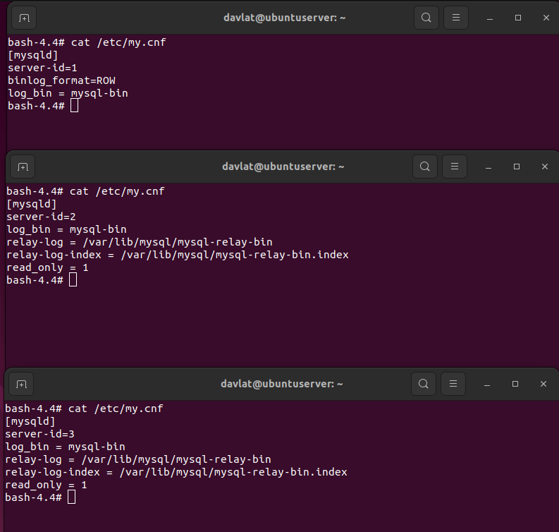
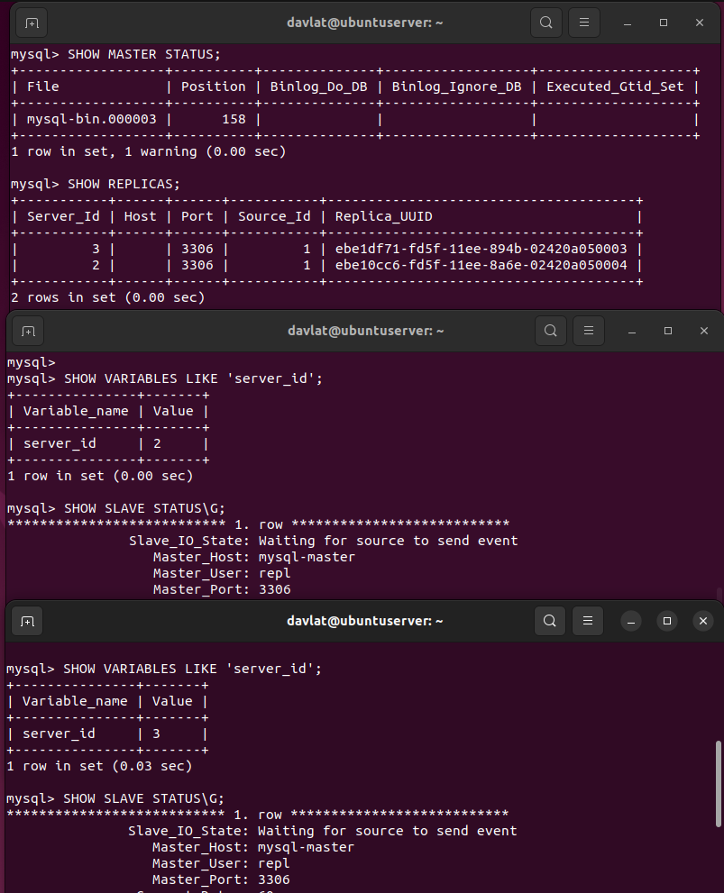
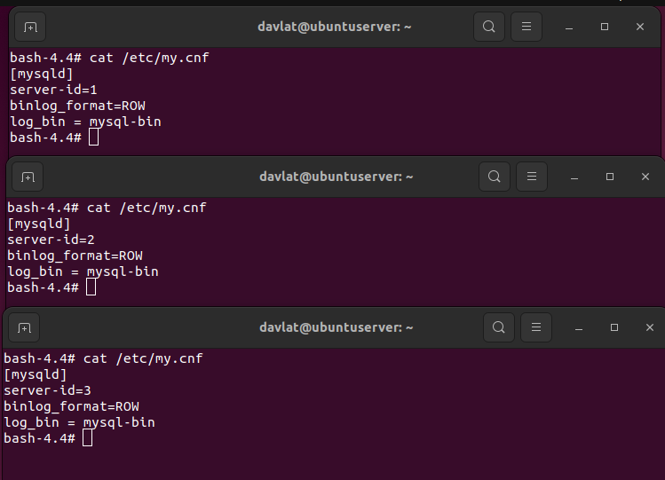
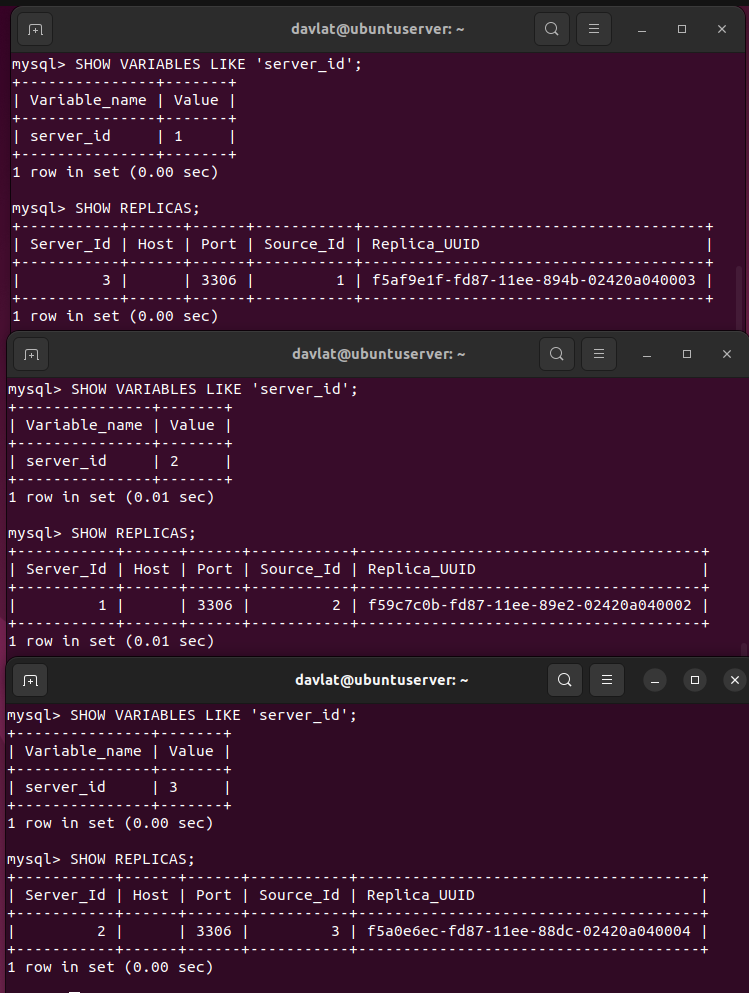

# "Домашнее задание к занятию «Репликация и масштабирование. Часть 1»" - Файзиев Давлат.

### Задание 1

На лекции рассматривались режимы репликации master-slave, master-master, опишите их различия.

*Ответить в свободной форме.*

### Решение 1

- Режим Master-Slave: 
В этом режиме один сервер (master) выполняет все операции записи, а другие серверы (slaves) синхронизируют данные с master-сервера, выполняя операции чтения. 
Этот режим обеспечивает высокую доступность данных, так как даже если master-сервер выйдет из строя, операции чтения могут продолжаться на slave-серверах. 
Однако, в этом режиме все операции записи могут выполняться только на master-сервере,
 что может стать узким местом при высокой нагрузке на запись.
- Режим Master-Master:
В этом режиме все серверы могут выполнять операции записи, что позволяет распределять нагрузку на запись между серверами. 
Это улучшает производительность и обеспечивает более высокую доступность данных, так как даже если один из серверов выйдет из строя, другие серверы могут продолжать обрабатывать операции записи. 
Однако, такой режим требует более сложной настройки и может привести к конфликтам данных, если одни и те же данные изменяются на разных серверах одновременно.

---

### Задание 2

Выполните конфигурацию master-slave репликации, примером можно пользоваться из лекции.

*Приложите скриншоты конфигурации, выполнения работы: состояния и режимы работы серверов.*

### Решение 2

Cкриншот конфигурации:

Cкриншот состояния и режимы работы серверов:

---
## Дополнительные задания (со звёздочкой*)
Эти задания дополнительные, то есть не обязательные к выполнению, и никак не повлияют на получение вами зачёта по этому домашнему заданию. Вы можете их выполнить, если хотите глубже шире разобраться в материале.

---

### Задание 3* 

Выполните конфигурацию master-master репликации. Произведите проверку.

*Приложите скриншоты конфигурации, выполнения работы: состояния и режимы работы серверов.*

### Решение 3

Cкриншот конфигурации:

Cкриншот состояния и режимы работы серверов:

---
